# 📓 Blog App

A simple and modern blog application built with **Flutter**.  
This app allows users to **sign up**, **sign in**, and **create blog posts** with images, topics, and rich content.  
It showcases **form validation**, **state management**, and **responsive UI design**.

---

## ✨ Features

- 🔐 **Authentication**
  - Sign Up with name, email, and password
  - Sign In with email and password
  - Inline form validation and error messages

- 📝 **Create Blogs**
  - Upload an image
  - Choose multiple topics (Technology, Business, Programming, etc.)
  - Enter blog title and content
  - Real-time form validation

- 📚 **Blog Dashboard**
  - View all created blogs with their tags and estimated reading time
  - Smooth navigation between blog list and blog details

- 📖 **Blog Details Page**
  - Read full content of selected blogs
  - Display of author, publish date, and reading time

- 🖤 **Modern UI**
  - Clean dark theme
  - Gradient buttons and rounded components

---

## 📸 Screenshots

### 🖊️ Sign Up
| Empty | Errors | Filled |
|-------|-------|-------|
| 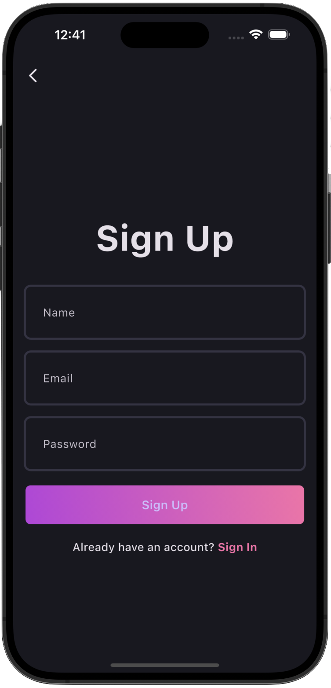 | 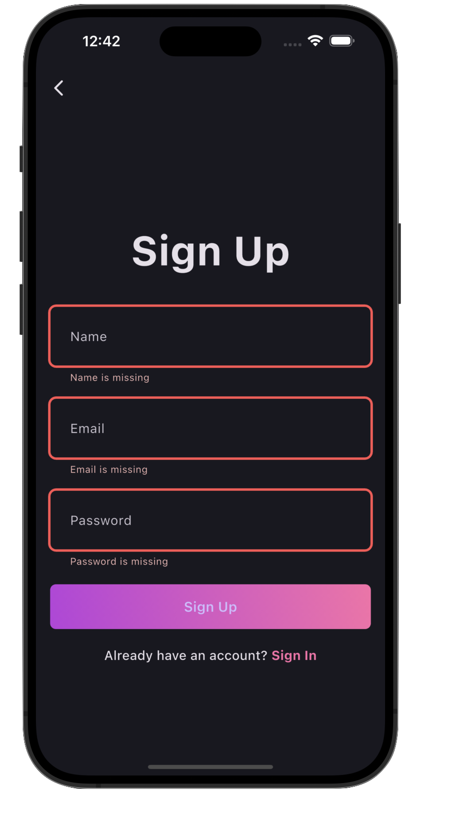 | 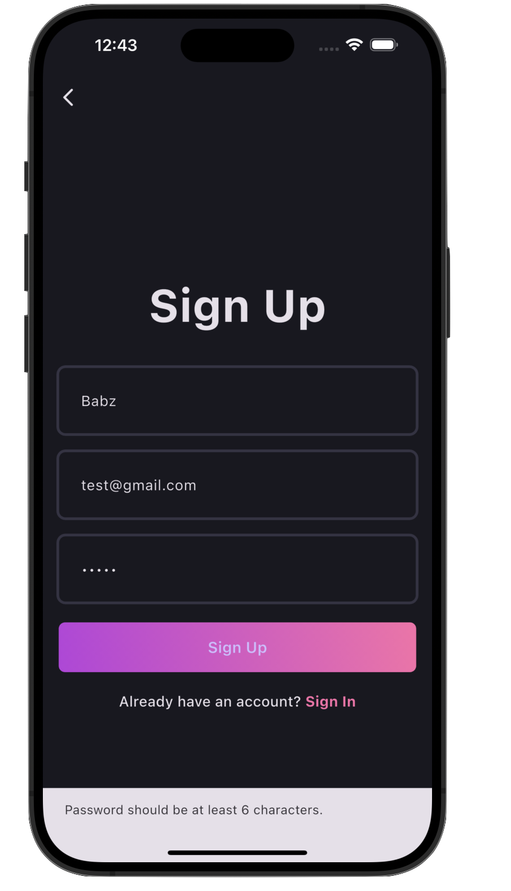 |

### 🔐 Sign In
| Empty | Errors | Filled |
|-------|-------|-------|
| 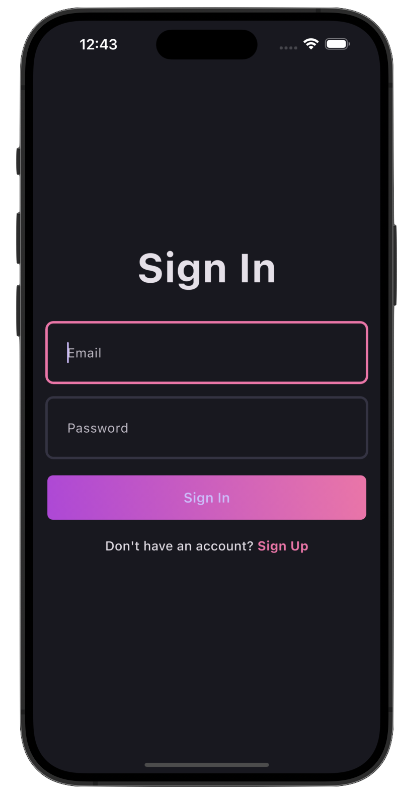 | 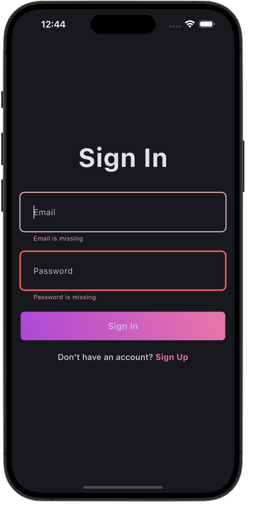 | 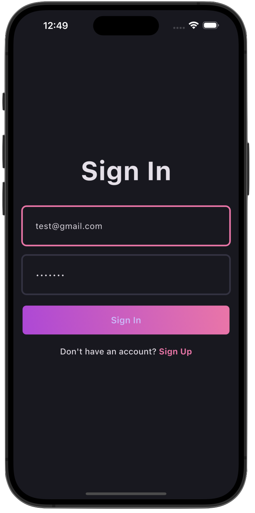 |

### 🏠 Blog Dashboard
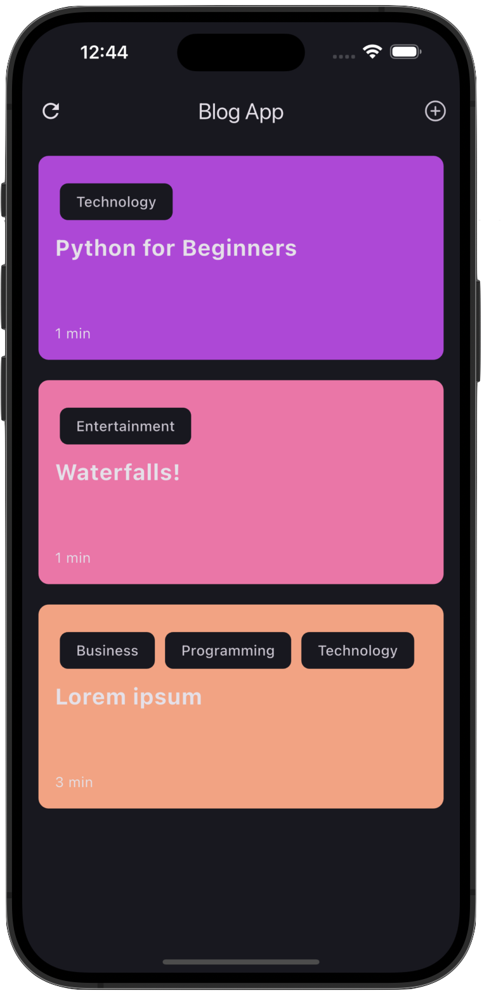

### 📝 Create Blog
| Empty | Errors | Filled |
|-------|-------|-------|
| 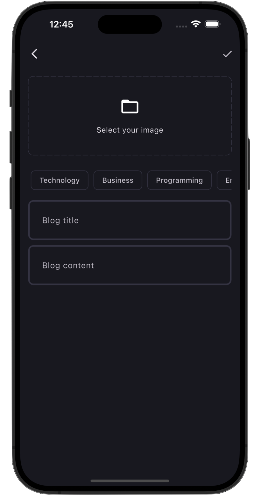 | 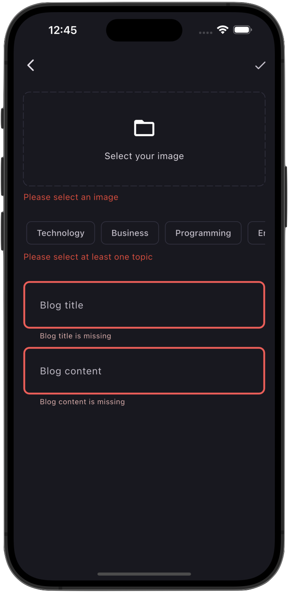 | 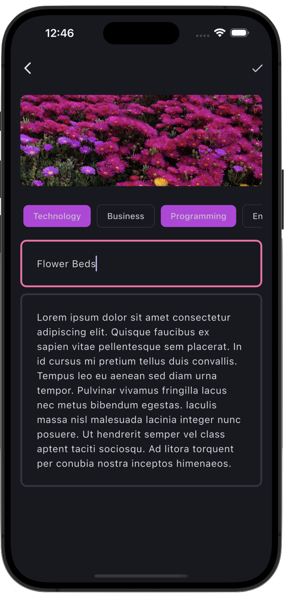 |

### 📖 Blog Details
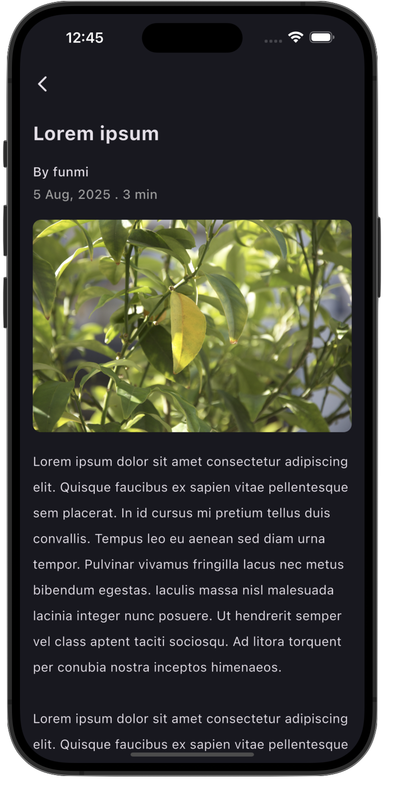

---

## 🛠️ Tech Stack
- Flutter
- Bloc
- Supabase
